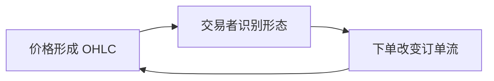

# 一句话理解

K 线分析只做一件事：**把某一周期内开、高、低、收四个价格，压缩成一根「多空力量快照」**，然后逼你回答三个问题——**现在是什么环境、这根 K 线在环境里扮演什么角色、我凭什么相信下一根会延续**。

它的三根支柱是：

| 支柱 | 一句话 | 观测入口 |
|---|---|---|
| 结构律 | 单根 K 线没有方向，**序列才有** | 连续 K 线的重叠度、高低点递进 |
| 位置律 | 同一根锤子线在支撑与阻力意义相反 | 当前价在区间中的分位 |
| 期望律 | 形态必须算期望，不能只报胜率 | 胜率 × 平均盈利 − 败率 × 平均亏损 − 成本 |

**它真正稀缺的不是「认形态」，而是「环境优先」**：Al Brooks 的价格行为学把市场分成趋势环境（SOM）与震荡环境（LOM）——十字星在趋势里是延续，在震荡里是反转预备。**名字一样，剧本相反。**

但必须把另一半说清楚：

> 【分析】Marshall、Young & Rose（2006）用 bootstrap 在道琼斯成分股上检验经典蜡烛图策略，**未发现统计显著的超额收益**。【待验证】Gregory Morris 的统计则显示，锤子线准确率约 44%、上吊线约 63%——**同一族形态，位置不同、准确率可差 19 个百分点**。K 线不是无效，而是**被当成「背名字就能赚钱」时最危险**。

---

<!-- nav:入口 -->

# 这个领域到底是什么

## 一句话边界

K 线分析研究的**不是公司值多少钱，而是给定周期里买卖双方谁更着急、谁更犹豫**。它把连续成交压缩成 OHLC 四元组，再用实体与影线的几何关系，推断**力量对比的瞬时快照**。

**边界**：它解释「行为痕迹」，不解释「行为原因」；它擅长描述**已经发生的博弈**，不擅长单独预测**尚未发生的消息**。

## 用 15 个问题划定边界

| 问题 | 答案 |
|---|---|
| 研究什么 | 开高低收构成的**价格-时间结构**，及多根 K 线形成的形态序列 |
| 边界在哪 | 只管图形可读的力量对比，不管基本面估值 |
| 核心对象 | 单根 K 线（bar）与形态组合（pattern） |
| 参与者 | 主动交易者、做市商、算法、被动资金——都在同一根 K 上留下脚印 |
| 核心变量 | 实体比、影线比、收盘位置、重叠度、趋势/震荡环境 |
| 可观察 | OHLC、颜色、序列高低点、区间边界 |
| 不可观察但可推断 | 大单意图、止损集群位置、被套盘心理 |
| 谁影响谁 | 订单流 → K 线形态 → 技术派跟随 → 流动性变化 → 下一根 K 线 |
| 确定因果 | 放量大实体突破区间 → 止损触发 → 加速（在趋势环境中） |
| 只是相关 | 「出现吞没」与「次日上涨」——相关，方向取决于位置与环境 |
| 表层现象 | 锤子、黄昏星、三兵等形态标签 |
| 底层机制 | 止损集中、流动性真空、行为金融中的处置效应与羊群 |
| 反馈 | 正反馈：突破吸引跟随；负反馈：极端波动引发获利了结 |
| 时间延迟 | 形态识别到可交易确认，常需 1–3 根 K 线 |
| 正负反馈 | 趋势中的趋势 K 线＝正反馈；震荡中的假突破＝负反馈 |

## 历史坐标

| 阶段 | 人物/事件 | 意义 |
|---|---|---|
| 18 世纪 | 本间宗久（酒田）· 日本米市 | 【事实】蜡烛图起源于实物商品，强调**供需情绪的可视化** |
| 1991 | Steve Nison《日本蜡烛图技术》 | 【事实】系统引入西方，形态命名体系定型 |
| 2006 | Marshall et al. · *Journal of Banking & Finance* | 【事实】DJIA 成分股 bootstrap 检验：**经典蜡烛策略无显著超额** |
| 2009 | Lu & Shiu · *Quarterly Review of Economics and Finance* | 【分析】再检验：多数蜡烛选股策略**难以击败随机** |
| 2010s– | Al Brooks 价格行为 · 逐根 K 线 | 【分析】从「背形态」转向「读环境 + 读序列」 |
| 2024–2025 | 中国程序化交易监管框架 | 【事实】高频/程序化占比上升，**原始 K 线信号的噪声结构改变** |

## 与相邻方法的区别

| 方法 | 问的问题 | 与 K 线的关系 |
|---|---|---|
| 线图/柱状图 | 收盘趋势？ | K 线额外提供**日内博弈结构** |
| 西方形态（头肩、双顶） | 大结构反转？ | 可叠加：K 线提供**微观确认** |
| 威科夫/量价 | 谁在吸筹派发？ | K 线是**微观证据层**，需配合成交量 |
| 指标（MACD/RSI） | 动量/超买超卖？ | 【推论】指标背离往往**先于**在 K 线上可读 |
| 订单流/Level2 | 此刻谁在挂单？ | 现代「读磁带」；K 线是**聚合后的结果** |

---

# 为什么值得研究

## 四个理由

:::cards g2
### 它是所有技术分析的「通用字母表」
不管学威科夫、道氏还是缠论，**最后都要落到 K 线上**。掌握 OHLC 的读法，等于掌握后续一切方法的输入格式。

### 它训练「环境意识」而非「形态迷信」
好的 K 线训练不是背 50 个名字，而是**先判趋势/震荡，再判这根 K 在结构中的角色**。这个顺序能迁移到任何决策：先看上下文，再看证据。

### 它的失败模式可被统计戳破
【事实】学术检验与 Morris 形态统计共同说明：**裸形态胜率常在 40%–60% 摇摆**。知道这一点，你就不会再被「65% 胜率」的二手故事唬住。

### 它的学习成本极低、验证极快
一张图、一支笔、30 分钟遮图测验——**今天就能得到关于自己的客观数据**，不需要昂贵终端。
:::

## 但也先说清楚：它被严重误用

- **形态通胀**：任何下跌后的长下影都可叫「锤子」，任何上涨后的十字星都可叫「犹豫」——**标签越多，信息越少**。
- **周期错配**：用 1 分钟 K 线的 pin bar 去验证周线趋势——**层级错配是散户亏损的头号原因**。
- **忽略成本**：形态「胜率 55%」若平均赢 1.5%、输 1.8%、成本 0.3%，期望为负——**不算期望等于没学**。

:::note amber 一句话定性
K 线分析是一套**高质量的观察协议**，配上一套**中等质量的形态模板**。协议部分几乎无法被替代；模板部分必须你自己重新统计。
:::

---

<!-- nav:世界模型 -->

# 世界地图

K 线分析要在九个层级之间切换。**用分钟级形态解释月线结构**，是最常见的失败路径。

:::raw
<svg viewBox="0 0 680 620" width="100%" style="max-width:680px">
  <text x="12" y="18" font-size="12.5" font-weight="700" fill="#15181d" font-family="sans-serif">K 线分析的九层世界（自上而下：环境 → 结构 → 事件 → 执行 → 自我）</text>
  <rect x="12" y="32" width="656" height="52" rx="9" fill="#f0f4fd" stroke="#c3d1f0" stroke-width="1.3"/>
  <text x="26" y="52" font-size="12" font-weight="700" fill="#1d4ed8" font-family="sans-serif">L1 · 宏观与流动性层</text>
  <text x="26" y="70" font-size="10.5" fill="#454c56" font-family="sans-serif">利率 · 政策 · 汇率 · 风险溢价 — 决定「趋势能不能延续」</text>
  <rect x="12" y="92" width="656" height="52" rx="9" fill="#f2f7f4" stroke="#c6dcc9" stroke-width="1.3"/>
  <text x="26" y="112" font-size="12" font-weight="700" fill="#0f8a4d" font-family="sans-serif">L2 · 指数与板块层</text>
  <text x="26" y="130" font-size="10.5" fill="#454c56" font-family="sans-serif">大盘趋势 · 板块轮动 — 个股 K 线再漂亮，逆板块也难做</text>
  <rect x="12" y="152" width="656" height="52" rx="9" fill="#f7f6f2" stroke="#ded8c4" stroke-width="1.3"/>
  <text x="26" y="172" font-size="12" font-weight="700" fill="#8a6d1f" font-family="sans-serif">L3 · 多周期结构层</text>
  <text x="26" y="190" font-size="10.5" fill="#454c56" font-family="sans-serif">月/周/日/小时 — 大周期定方向，小周期定入场；**不可倒置**</text>
  <rect x="12" y="212" width="656" height="52" rx="9" fill="#fdf3f2" stroke="#f0cdc9" stroke-width="1.3"/>
  <text x="26" y="232" font-size="12" font-weight="700" fill="#d5342c" font-family="sans-serif">L4 · 市场环境层（SOM / LOM）</text>
  <text x="26" y="250" font-size="10.5" fill="#454c56" font-family="sans-serif">趋势环境 vs 震荡环境 — **同一根十字星，剧本相反**</text>
  <rect x="12" y="272" width="656" height="52" rx="9" fill="#fdf3f2" stroke="#f0cdc9" stroke-width="1.3"/>
  <text x="26" y="292" font-size="12" font-weight="700" fill="#d5342c" font-family="sans-serif">L5 · 区间与关键位层</text>
  <text x="26" y="310" font-size="10.5" fill="#454c56" font-family="sans-serif">支撑阻力 · 前高前低 · 缺口 — 形态必须「贴」在关键位上才有意义</text>
  <rect x="12" y="332" width="656" height="52" rx="9" fill="#f6f2fb" stroke="#dccdf0" stroke-width="1.3"/>
  <text x="26" y="352" font-size="12" font-weight="700" fill="#6b3fa0" font-family="sans-serif">L6 · 单根与短序列层</text>
  <text x="26" y="370" font-size="10.5" fill="#454c56" font-family="sans-serif">趋势 K 线 · 十字星 · 吞没 · 内包 — 1–5 根 K 线的力量对比</text>
  <rect x="12" y="392" width="656" height="52" rx="9" fill="#f2f8fb" stroke="#c4dde9" stroke-width="1.3"/>
  <text x="26" y="412" font-size="12" font-weight="700" fill="#1a6d8a" font-family="sans-serif">L7 · 经典形态组合层</text>
  <text x="26" y="430" font-size="10.5" fill="#454c56" font-family="sans-serif">启明星 · 黄昏星 · 三兵 · 乌云盖顶 — 3 根以上的模板化组合</text>
  <rect x="12" y="452" width="656" height="52" rx="9" fill="#f4f6f9" stroke="#c9d0d9" stroke-width="1.3"/>
  <text x="26" y="472" font-size="12" font-weight="700" fill="#454c56" font-family="sans-serif">L8 · 执行与成本层</text>
  <text x="26" y="490" font-size="10.5" fill="#454c56" font-family="sans-serif">滑点 · 冲击 · 止损距离 · 仓位 — 你的动作会改变被观测的 K 线</text>
  <rect x="12" y="512" width="656" height="60" rx="9" fill="#fff8ec" stroke="#f0dcb4" stroke-width="1.4"/>
  <text x="26" y="532" font-size="12" font-weight="700" fill="#a06800" font-family="sans-serif">L9 · 你的认知与叙事层</text>
  <text x="26" y="550" font-size="10.5" fill="#454c56" font-family="sans-serif">持仓方向会塑造你对同一根 K 线的解读 — 多头眼里全是「洗盘」，空头眼里全是「诱多」</text>
  <text x="26" y="566" font-size="10.5" fill="#a06800" font-family="sans-serif">→ 遮图盲测是唯一能绕过 L9 污染的训练</text>
  <text x="12" y="614" font-size="10.5" fill="#7c848f" font-family="sans-serif">上层约束下层：L4 决定 L6 怎么读；L9 决定你能不能正确执行 L8</text>
</svg>
:::

---

# 核心概念地图

## 一根 K 线的四个维度

| 维度 | 读法 | 力量含义 |
|---|---|---|
| 实体大小 | \|收−开\| ÷ (高−低) | 多空一方是否**控盘收盘** |
| 上影线 | (高−max(开,收)) ÷ 范围 | 上方抛压、被拒绝的幅度 |
| 下影线 | (min(开,收)−低) ÷ 范围 | 下方承接、买盘防守 |
| 收盘位置 | (收−低) ÷ 范围 | 最终谁赢——**比颜色更重要** |

**示例**（O=100, H=105, L=98, C=104）：实体比 57.1%，下影 28.6%，上影 14.3%，收盘位置 85.7%——偏多但未极端（力量分约 +0.554）。

## 六类基础 K 线（PA 框架）

:::cards g3
### 趋势 K 线（Trend Bar）
大实体、小影线。表示一方**一路控盘**，在趋势环境中顺势解读。

### 十字星（Doji）
开收接近。表示**均衡/犹豫**——在趋势中常是喘息，在震荡边界常是反转预备。

### 长影线 K 线（Pin Bar）
一侧影线 ≥ 实体 2 倍。表示该方向**被拒绝**——但必须贴在关键位上。

### 吞没（Engulfing）
后一根实体完全包住前一根。表示**力量反转尝试**——【待验证】单标的回测胜率约 57%–65%，不可外推。

### 内包（Inside Bar）
高低点完全在前一根之内。表示**波动收缩**，突破方向需等下一根确认。

### 外包（Outside Bar）
高低点完全包住前一根。表示**波动扩张**，常伴随止损触发与方向选择。
:::

## 环境二分法（Al Brooks）

| 环境 | 识别特征 | K 线读法 |
|---|---|---|
| SOM（趋势） | 高低点递进、K 线重叠少 | 十字星＝顺势延续；回调 K 线＝入场机会 |
| LOM（震荡） | K 线密集重叠、区间清晰 | 区间边缘的弱 K 线＝逆势机会；中部信号＝噪声 |

:::note blue 顺序比名字重要
「启明星」三个字没有信息；**「震荡区间下沿 + 放量阳线吞没 + 次日不破低」**这个序列才有信息。乱序出现的事件，优先当噪声。
:::

---

# 核心参与者

| 参与者 | 在 K 线上留下什么 | 如何误读 |
|---|---|---|
| 趋势跟随者 | 连续趋势 K 线、突破放量 | 把趋势末端当成「还会涨」 |
| 区间交易者 | 边界长影线、假突破 | 把第一次刺破当成真突破 |
| 做市商/高频 | 瞬间长影线、异常成交量 | 误读为「主力吸筹」 |
| 止损集群 | 针刺后快速收回（流动性猎取） | 事后贴标签「锤子线」 |
| 被动指数资金 | 平滑、低信息成交量 | 污染「放量/缩量」信号 |
| 程序化策略 | 2024 起须「先报告后交易」 | 【事实】监管要求验资验券、阈值管理，**微观结构更规范也更「假」** |
| 你（观察者） | 选择性记忆、叙事后贴 | 盈利 K 线记得牢，亏损 K 线忘掉快 |

:::note red 现代市场最大的变化
【待验证】量化私募占 A 股流通市值约 2%–3%，却贡献日均成交额 30%–40%。**你看到的 K 线里，有相当一部分是算法博弈的聚合结果**，不是「一个人的情绪」。这不会让 K 线失效，但会降低原始形态的纯度。
:::

---

# 核心变量

| 变量 | 定义 | 为什么重要 |
|---|---|---|
| 实体比 b | \|C−O\|/(H−L) | 衡量「收盘控盘度」；b→0 为犹豫 |
| 收盘位置 q | (C−L)/(H−L) | 同为大阳线，q 接近 1 强于 q 接近 0.6 |
| 重叠度 o | 连续 K 线区间交集比例 | o 上升 → 环境从 SOM 滑向 LOM |
| 位置分位 p | 现价在区间中的百分位 | **p<20% 的锤子 ≠ p>80% 的锤子** |
| 量比 v | 当前量 ÷ 均量 | 突破/反转的「确认」变量 |
| 期望 E | p·W − (1−p)·L − c | **唯一决定长期盈亏的汇总变量** |

默认参数下（胜率 55%、赢 3%、输 2%、成本 0.3%）：**E = +0.45%/笔**——看似不错，但样本 100 笔才约 +45%，且未计冲击。

---

# 因果关系

## 主因果链：从订单到 K 线再到你的决策

:::raw
<svg viewBox="0 0 680 400" width="100%" style="max-width:680px">
  <defs>
    <marker id="klG" markerWidth="9" markerHeight="9" refX="8" refY="3" orient="auto">
      <path d="M0,0 L8,3 L0,6 z" fill="#454c56"/>
    </marker>
    <marker id="klR" markerWidth="9" markerHeight="9" refX="8" refY="3" orient="auto">
      <path d="M0,0 L8,3 L0,6 z" fill="#d5342c"/>
    </marker>
  </defs>
  <rect x="14" y="24" width="140" height="50" rx="8" fill="#f0f4fd" stroke="#c3d1f0" stroke-width="1.3"/>
  <text x="24" y="44" font-size="11.5" font-weight="700" fill="#1d4ed8" font-family="sans-serif">① 订单与流动性</text>
  <text x="24" y="60" font-size="10" fill="#454c56" font-family="sans-serif">买卖意愿 · 深度</text>
  <rect x="170" y="24" width="140" height="50" rx="8" fill="#f4f6f9" stroke="#c9d0d9" stroke-width="1.3"/>
  <text x="180" y="44" font-size="11.5" font-weight="700" fill="#15181d" font-family="sans-serif">② OHLC 聚合</text>
  <text x="180" y="60" font-size="10" fill="#454c56" font-family="sans-serif">周期内四价定格</text>
  <rect x="326" y="24" width="140" height="50" rx="8" fill="#f4f6f9" stroke="#c9d0d9" stroke-width="1.3"/>
  <text x="336" y="44" font-size="11.5" font-weight="700" fill="#15181d" font-family="sans-serif">③ 形态识别</text>
  <text x="336" y="60" font-size="10" fill="#454c56" font-family="sans-serif">人/算法贴标签</text>
  <rect x="482" y="24" width="184" height="50" rx="8" fill="#fdf3f2" stroke="#f0cdc9" stroke-width="1.3"/>
  <text x="492" y="44" font-size="11.5" font-weight="700" fill="#d5342c" font-family="sans-serif">④ 交易执行</text>
  <text x="492" y="60" font-size="10" fill="#454c56" font-family="sans-serif">你的单也会改变 ①</text>
  <line x1="156" y1="49" x2="166" y2="49" stroke="#454c56" stroke-width="1.3" marker-end="url(#klG)"/>
  <line x1="312" y1="49" x2="322" y2="49" stroke="#454c56" stroke-width="1.3" marker-end="url(#klG)"/>
  <line x1="468" y1="49" x2="478" y2="49" stroke="#454c56" stroke-width="1.3" marker-end="url(#klG)"/>
  <rect x="200" y="110" width="280" height="50" rx="8" fill="#fff8ec" stroke="#f0dcb4" stroke-width="1.3"/>
  <text x="210" y="130" font-size="11.5" font-weight="700" fill="#a06800" font-family="sans-serif">环境过滤器（L4）</text>
  <text x="210" y="146" font-size="10" fill="#454c56" font-family="sans-serif">SOM/LOM · 多周期 · 关键位 — 决定 ③ 的解读方向</text>
  <line x1="394" y1="74" x2="340" y2="108" stroke="#a06800" stroke-width="1.2" marker-end="url(#klG)"/>
  <path d="M340,160 C340,220 120,220 84,160" fill="none" stroke="#d5342c" stroke-width="1.2" stroke-dasharray="5 4" marker-end="url(#klR)"/>
  <text x="24" y="200" font-size="10.5" fill="#d5342c" font-family="sans-serif">跳过环境 → 形态标签泛滥 → ④ 负期望</text>
  <rect x="14" y="250" width="652" height="130" rx="9" fill="#f4f6f9" stroke="#c9d0d9" stroke-width="1.2"/>
  <text x="26" y="272" font-size="11.5" font-weight="700" fill="#15181d" font-family="sans-serif">因果 vs 相关（必读）</text>
  <text x="26" y="292" font-size="10.5" fill="#454c56" font-family="sans-serif">✓ 因果：趋势环境中回调缩量 + 趋势 K 线恢复 → 延续概率上升（机制：浮筹已洗）</text>
  <text x="26" y="310" font-size="10.5" fill="#454c56" font-family="sans-serif">✗ 相关：出现锤子 → 次日上涨（Morris：锤子仅 44%，常低于随机）</text>
  <text x="26" y="328" font-size="10.5" fill="#454c56" font-family="sans-serif">✗ 错误：背下 50 个形态 → 稳定盈利（Marshall 2006：bootstrap 下无显著超额）</text>
  <text x="26" y="346" font-size="10.5" fill="#454c56" font-family="sans-serif">✓ 因果：高期望结构 = 胜率 × 盈亏比 − 成本 &gt; 0 — 这才是可检验的命题</text>
</svg>
:::

---

# 隐藏关系

## 隐藏关系一：胜率会随市场漂移自动上升

【分析】任何「持有 N 日胜率 60%」的宣称，都必须与**随机做多基准**对照。μ=10%、σ=18% 时：

| 持有期 | 随机做多基准胜率 |
|---|---|
| 5 日 | 53.12% |
| 10 日 | 54.41% |
| 20 日 | 56.22% |
| 40 日 | **58.76%** |

若某形态报告 40 日胜率 65%，**真实超额仅约 +6.3 pp**；在 μ=20%、σ=12% 的牛市里，随机做多 40 日胜率升至 **74.7%**——同一数字反而**跑输基准 9.7 pp**。

:::raw

  
<h4>工具 1 · 漂移剥离器：形态胜率里有多少是「市场自己在涨」</h4>

  
p_base = Φ( μ·(T/252) ÷ (σ·√(T/252)) )。把形态报告胜率与随机做多基准对比，看真实超额与所需样本量。

  <canvas id="klDriftChart" height="176" style="height:176px;margin:4px 0 10px"></canvas>
  

    <label for="kl_T">持有期（交易日）</label>
    <input type="range" id="kl_T" min="5" max="60" step="1" value="40">
    <output id="kl_TO">40 日</output>
  

  

    <label for="kl_ps">形态报告胜率</label>
    <input type="range" id="kl_ps" min="44" max="70" step="0.1" value="55.0">
    <output id="kl_psO">55.0%</output>
  

  

    <label for="kl_mu">市场年化漂移</label>
    <input type="range" id="kl_mu" min="0" max="20" step="0.5" value="10">
    <output id="kl_muO">10%</output>
  

  

    <label for="kl_sg">市场年化波动</label>
    <input type="range" id="kl_sg" min="10" max="40" step="1" value="18">
    <output id="kl_sgO">18%</output>
  

  

    

随机做多基准

58.8%

相同持有期

    

真实超额

−3.8 pp

形态 − 基准

    

证明非随机所需样本

∞

单侧 5%、检验力 80%

    

      
判定

      
无超额

      
扣掉漂移后跑输随机做多

    

  

:::

## 隐藏关系二：形态挖掘的假阳性洪水

你若测试 50 种 K 线形态、显著性 α=5%，在**形态全部无效**的零假设下，仍期望出现 **2.5 个「显著」假阳性**。回测 20 次累计约 **50 个**——这就是为什么「我在历史数据里找到了圣杯」几乎总是数据挖掘。

:::raw

  
<h4>工具 4 · 形态挖掘警示：测试 N 个形态会冒出多少假阳性</h4>

  <canvas id="klFdrChart" height="214" style="height:214px;margin:4px 0 10px"></canvas>
  

    <label for="kl_patN">形态库数量 N</label>
    <input type="range" id="kl_patN" min="5" max="100" step="1" value="50">
    <output id="kl_patNO">50 种</output>
  

  

    <label for="kl_alpha">单次检验显著性 α</label>
    <input type="range" id="kl_alpha" min="1" max="10" step="0.5" value="5">
    <output id="kl_alphaO">5.0%</output>
  

  

    <label for="kl_trials">回测扫描次数</label>
    <input type="range" id="kl_trials" min="1" max="50" step="1" value="10">
    <output id="kl_trialsO">10 次回测</output>
  

  

    

期望假阳性

2.5 个

单次扫描

    

Bonferroni 门槛

0.100%

α ÷ N

    

      
判定

      
高危挖掘

      
发现形态多半只是噪声

    

  

:::

## 跨域同构

| K 线概念 | 其他领域的同名结构 |
|---|---|
| 实体 vs 影线 | 信号 vs 噪声（信噪比） |
| SOM / LOM 环境切换 | 动力系统中的相变 |
| 形态回测过拟合 | 多重检验 / 粒子物理 5σ |
| 止损集群被触发 | 相变临界点 / 雪崩模型 |
| 期望 E = pW − (1−p)L | 凯利公式 / 赌场优势 |

---

# 系统运行机制

K 线分析在市场中是一个**三层循环**：

1. **价格层**：撮合引擎把成交聚合为 K 线——这是【事实】层，不可辩驳。
2. **解释层**：人类与算法给 K 线贴标签——这是【假设】层，可错。
3. **反馈层**：解释触发交易，交易改变下一根 K 线——这是【机制】层，也是「技术分析有时看似有效」的来源之一（**自实现预言**，但强度有限）。

**关键洞察**：第 2 层和第 3 层之间隔着**成本、延迟、仓位约束**。大多数人停在第 2 层，以为「认对了就能赚」。

---

# 时间演化

## K 线分析的四次范式迁移

:::raw
<svg viewBox="0 0 680 280" width="100%" style="max-width:680px">
  <line x1="40" y1="140" x2="640" y2="140" stroke="#c9d0d9" stroke-width="2"/>
  <circle cx="80" cy="140" r="7" fill="#8a6d1f"/>
  <text x="80" y="118" text-anchor="middle" font-size="11" font-weight="700" fill="#8a6d1f" font-family="sans-serif">1750s</text>
  <text x="80" y="168" text-anchor="middle" font-size="10" fill="#454c56" font-family="sans-serif">酒田米市</text>
  <text x="80" y="184" text-anchor="middle" font-size="9.5" fill="#7c848f" font-family="sans-serif">原始蜡烛图</text>
  <circle cx="220" cy="140" r="7" fill="#1d4ed8"/>
  <text x="220" y="118" text-anchor="middle" font-size="11" font-weight="700" fill="#1d4ed8" font-family="sans-serif">1991</text>
  <text x="220" y="168" text-anchor="middle" font-size="10" fill="#454c56" font-family="sans-serif">Nison 西传</text>
  <text x="220" y="184" text-anchor="middle" font-size="9.5" fill="#7c848f" font-family="sans-serif">形态百科全书</text>
  <circle cx="380" cy="140" r="7" fill="#d5342c"/>
  <text x="380" y="118" text-anchor="middle" font-size="11" font-weight="700" fill="#d5342c" font-family="sans-serif">2006</text>
  <text x="380" y="168" text-anchor="middle" font-size="10" fill="#454c56" font-family="sans-serif">学术证伪潮</text>
  <text x="380" y="184" text-anchor="middle" font-size="9.5" fill="#7c848f" font-family="sans-serif">bootstrap 无超额</text>
  <circle cx="540" cy="140" r="7" fill="#0f8a4d"/>
  <text x="540" y="118" text-anchor="middle" font-size="11" font-weight="700" fill="#0f8a4d" font-family="sans-serif">2010s</text>
  <text x="540" y="168" text-anchor="middle" font-size="10" fill="#454c56" font-family="sans-serif">价格行为复兴</text>
  <text x="540" y="184" text-anchor="middle" font-size="9.5" fill="#7c848f" font-family="sans-serif">环境优先·数K线</text>
  <circle cx="640" cy="140" r="7" fill="#6b3fa0"/>
  <text x="640" y="118" text-anchor="middle" font-size="11" font-weight="700" fill="#6b3fa0" font-family="sans-serif">2024+</text>
  <text x="640" y="168" text-anchor="middle" font-size="10" fill="#454c56" font-family="sans-serif">程序化监管</text>
  <text x="640" y="184" text-anchor="middle" font-size="9.5" fill="#7c848f" font-family="sans-serif">微观结构重塑</text>
  <text x="340" y="248" text-anchor="middle" font-size="11" fill="#454c56" font-family="sans-serif">演化方向：从「背形态名字」→「读环境+算期望+样本外验证」</text>
</svg>
:::

| 时代 | 主导玩法 | 失效原因 |
|---|---|---|
| 纸带时代 | 读日内波动节奏 | 市场深度与速度变化 |
| 形态百科时代 | 背 50+ 形态 | 统计检验暴露过拟合 |
| PA 时代 | 环境 + 序列 + 风控 | 需要大量练习，难以速成 |
| 算法共存时代 | K 线 + 订单流 + 监管合规 | 噪声上升，需更严的期望计算 |

---

# 利益与激励

| 利益方 | 激励 | 对 K 线叙事的影响 |
|---|---|---|
| 券商/交易所 | 交易量 ↑ | 鼓励「每天都有信号」的内容 |
| 课程卖家 | 卖简单答案 | 把 40%–60% 胜率包装成「秘籍」 |
| 财经媒体 | 点击率 | 事后贴形态标签（「教科书级黄昏星」） |
| 量化私募 | 做市/套利 | 利用散户止损集群——**你读的 pin bar 可能是被设计的** |
| 监管 | 市场公平 | 【事实】2024《程序化交易管理规定》：先报告后交易、异常交易监控 |
| 你自己 | 快速致富幻想 | 选择性记忆盈利形态、遗忘亏损 |

**核心错配**：你付费学的是「形态大全」，市场奖励的是「期望为正 + 仓位纪律」——两者不是一回事。

---

# 资源与信息流

## 信息流与「抽水」

:::raw
<svg viewBox="0 0 680 320" width="100%" style="max-width:680px">
  <defs>
    <marker id="klP" markerWidth="9" markerHeight="9" refX="8" refY="3" orient="auto">
      <path d="M0,0 L8,3 L0,6 z" fill="#454c56"/>
    </marker>
  </defs>
  <rect x="20" y="40" width="120" height="44" rx="8" fill="#f0f4fd" stroke="#c3d1f0"/>
  <text x="32" y="66" font-size="11" font-weight="700" fill="#1d4ed8" font-family="sans-serif">交易所撮合</text>
  <rect x="180" y="40" width="120" height="44" rx="8" fill="#f4f6f9" stroke="#c9d0d9"/>
  <text x="192" y="66" font-size="11" font-weight="700" fill="#15181d" font-family="sans-serif">OHLC 数据</text>
  <rect x="340" y="40" width="120" height="44" rx="8" fill="#f4f6f9" stroke="#c9d0d9"/>
  <text x="352" y="66" font-size="11" font-weight="700" fill="#15181d" font-family="sans-serif">图表平台</text>
  <rect x="500" y="40" width="160" height="44" rx="8" fill="#fdf3f2" stroke="#f0cdc9"/>
  <text x="512" y="66" font-size="11" font-weight="700" fill="#d5342c" font-family="sans-serif">你（解释+下单）</text>
  <line x1="142" y1="62" x2="176" y2="62" stroke="#454c56" marker-end="url(#klP)"/>
  <line x1="302" y1="62" x2="336" y2="62" stroke="#454c56" marker-end="url(#klP)"/>
  <line x1="462" y1="62" x2="496" y2="62" stroke="#454c56" marker-end="url(#klP)"/>
  <rect x="80" y="130" width="520" height="36" rx="6" fill="#fff8ec" stroke="#f0dcb4"/>
  <text x="92" y="152" font-size="10.5" fill="#a06800" font-family="sans-serif">抽水 1：延迟 — 免费行情晚 3–15 秒，形态已被算法消化</text>
  <rect x="80" y="178" width="520" height="36" rx="6" fill="#fff8ec" stroke="#f0dcb4"/>
  <text x="92" y="200" font-size="10.5" fill="#a06800" font-family="sans-serif">抽水 2：成本 — 佣金 + 印花税 + 滑点，直接吃掉期望</text>
  <rect x="80" y="226" width="520" height="36" rx="6" fill="#fff8ec" stroke="#f0dcb4"/>
  <text x="92" y="248" font-size="10.5" fill="#a06800" font-family="sans-serif">抽水 3：叙事 — 课程/社群只展示命中案例，幸存者偏差</text>
  <rect x="80" y="274" width="520" height="36" rx="6" fill="#fdf3f2" stroke="#f0cdc9"/>
  <text x="92" y="296" font-size="10.5" fill="#d5342c" font-family="sans-serif">抽水 4：自反馈 — 你的大单改变 K 线，你以为「看对了」</text>
</svg>
:::

## 可信信息源分级

| 层级 | 来源 | 怎么用 |
|---|---|---|
| A | 交易所官方行情、监管公告 | 【事实】基准 |
| B | 同行评审论文（Marshall 2006 等） | 【分析】方法论边界 |
| C | Morris/Nison 原书统计 | 【待验证】需自己复现 |
| D | 社群「胜率截图」 | 【假设】默认无效，除非提供完整交易日志 |

---

# 关键杠杆点

按 **重要性 × 杠杆率 × 可操作性 ÷ 学习成本** 排序的 10 个杠杆：

| # | 杠杆点 | 为什么有效 | 今天就能做 |
|---|---|---|---|
| 1 | **环境优先（SOM/LOM）** | 同一信号在不同环境意义相反 | 画区间，判重叠度 |
| 2 | **位置过滤** | Morris：锤子 44% vs 上吊 63%——位置差 19pp | 标注现价在区间的分位 |
| 3 | **算期望而非胜率** | E>0 才是可交易命题 | 用工具 3 填四个数 |
| 4 | **漂移剥离** | 避免把牛市漂移当成形态 alpha | 用工具 1 扣基准 |
| 5 | **确认 K 线** | 反转需次日/次根确认，减少假信号 | 规则：不确认不进 |
| 6 | **多周期共振** | 日线信号需周线结构支持 | 同图叠两周期 |
| 7 | **止损结构性** | 止损放在形态失效点，而非固定 % | 写下「什么价格证明我错了」 |
| 8 | **遮图盲测** | 绕过 L9 叙事污染 | 10 张图测命中率 |
| 9 | **预注册形态库** | 对抗数据挖掘（工具 4） | 交易前写下要测哪 3 个形态 |
| 10 | **交易日志** | 唯一产出真实统计的动作 | 每笔一行：假设+结果 |

---

# 常见认知陷阱

:::details 陷阱 1：把形态名字当成预测
**表现**：「出现黄昏星了，明天必跌。」
**真相**：【待验证】Morris 统计里流星线准确率约 48%，接近抛硬币。
**对策**：问「在什么环境、什么位置、有无确认？」——三个都答不出就不做。
:::

:::details 陷阱 2：单根 K 线交易
**表现**：看到 pin bar 就进场。
**真相**：【分析】PA 铁律：单根没有意义；序列 + 环境才有。
**对策**：至少等 1 根确认 K 线，或等突破内包线。
:::

:::details 陷阱 3：忽略漂移基准
**表现**：「我这个策略 40 日胜率 65%，太强了！」
**真相**：随机做多基准可能已是 58.76%，超额仅 6.3 pp。
**对策**：工具 1；μ=20% 牛市里 65% 反而跑输。
:::

:::details 陷阱 4：形态挖掘 / 过拟合
**表现**：测试 50 个形态，挑最亮眼的那个。
**真相**：期望假阳性 = 50×5% = 2.5 个「显著」噪声。
**对策**：工具 4；样本外 + Bonferroni。
:::

:::details 陷阱 5：周期错配
**表现**：5 分钟锤子线决定周线方向。
**真相**：小周期噪声在大周期上不可见。
**对策**：大周期定方向，小周期定时机——不可倒置。
:::

:::details 陷阱 6：幸存者偏差
**表现**：只记得「那次锤子线赚了 20%」。
**真相**：未记录的 9 次锤子线亏损被遗忘。
**对策**：强制交易日志；每周复盘命中/未命中。
:::

:::details 陷阱 7：把相关当因果
**表现**：「放量下跌后总是继续跌。」
**真相**：区间底部的放量下跌常是恐慌高潮（SC），不是续跌信号。
**对策**：先标位置分位 p，再读 K 线。
:::

:::details 陷阱 8：忽视交易成本
**表现**：胜率 55%、赢 1.5%、输 1.4%——「差不多」。
**真相**：加 0.3% 成本后 E 可能转负。
**对策**：工具 3 必须把成本滑块拉满你的真实水平。
:::

:::details 陷阱 9：叙事后贴标签（后视镜）
**表现**：跌完了才说「早就看出黄昏星」。
**真相**：事前同一图形可被解读为「洗盘」或「出货」。
**对策**：遮图测验；事前写下假设存档。
:::

:::details 陷阱 10：把学术证伪当成「K 线无用」
**表现**：「Marshall 说无效，我不学了。」
**真相**：论文否定的是**简单机械规则**，不是「读环境+算期望」的完整系统。
**对策**：学观察协议，自建统计；别学形态百科全书。
:::

:::details 陷阱 11：算法时代仍用纯视觉
**表现**：无视程序化占比对微观结构的影响。
**真相**：【事实】2025 上交所细则：高频认定每秒申报撤单 ≥300 笔。
**对策**：大周期为主；关键位结合成交量与订单流（若可得）。
:::

:::details 陷阱 12：仓位替你做分析
**表现**：已重仓，每根 K 线都读成利多。
**真相**：L9 层污染——持仓塑造叙事。
**对策**：用「若我现在空仓，还会进吗？」反问自己。
:::

---

# 从抽象到现实

## 三层映射：抽象 → 机制 → 操作

:::raw
<svg viewBox="0 0 680 300" width="100%" style="max-width:680px">
  <rect x="20" y="30" width="190" height="240" rx="10" fill="#f0f4fd" stroke="#c3d1f0" stroke-width="1.4"/>
  <text x="36" y="56" font-size="13" font-weight="700" fill="#1d4ed8" font-family="sans-serif">抽象层</text>
  <text x="36" y="80" font-size="10.5" fill="#454c56" font-family="sans-serif">· 多空力量均衡被打破</text>
  <text x="36" y="98" font-size="10.5" fill="#454c56" font-family="sans-serif">· 止损集群被触发</text>
  <text x="36" y="116" font-size="10.5" fill="#454c56" font-family="sans-serif">· 流动性真空</text>
  <text x="36" y="134" font-size="10.5" fill="#454c56" font-family="sans-serif">· 正/负反馈循环</text>
  <text x="36" y="170" font-size="10" fill="#7c848f" font-family="sans-serif">问：机制上发生了什么？</text>
  <rect x="245" y="30" width="190" height="240" rx="10" fill="#f2f7f4" stroke="#c6dcc9" stroke-width="1.4"/>
  <text x="261" y="56" font-size="13" font-weight="700" fill="#0f8a4d" font-family="sans-serif">机制层（K 线可读）</text>
  <text x="261" y="80" font-size="10.5" fill="#454c56" font-family="sans-serif">· 长下影 + 收高 q&gt;0.7</text>
  <text x="261" y="98" font-size="10.5" fill="#454c56" font-family="sans-serif">· 趋势 K 线序列</text>
  <text x="261" y="116" font-size="10.5" fill="#454c56" font-family="sans-serif">· 重叠度上升 → LOM</text>
  <text x="261" y="134" font-size="10.5" fill="#454c56" font-family="sans-serif">· 放量突破区间</text>
  <text x="261" y="170" font-size="10" fill="#7c848f" font-family="sans-serif">问：图上哪条证据支持？</text>
  <rect x="470" y="30" width="190" height="240" rx="10" fill="#fdf3f2" stroke="#f0cdc9" stroke-width="1.4"/>
  <text x="486" y="56" font-size="13" font-weight="700" fill="#d5342c" font-family="sans-serif">操作层</text>
  <text x="486" y="80" font-size="10.5" fill="#454c56" font-family="sans-serif">· 环境=SOM → 顺势</text>
  <text x="486" y="98" font-size="10.5" fill="#454c56" font-family="sans-serif">· 止损=形态失效点</text>
  <text x="486" y="116" font-size="10.5" fill="#454c56" font-family="sans-serif">· 仓位=赔率反推</text>
  <text x="486" y="134" font-size="10.5" fill="#454c56" font-family="sans-serif">· 日志=可验证</text>
  <text x="486" y="170" font-size="10" fill="#7c848f" font-family="sans-serif">问：今天具体做什么？</text>
  <text x="215" y="155" font-size="18" fill="#c9d0d9" font-family="sans-serif">→</text>
  <text x="440" y="155" font-size="18" fill="#c9d0d9" font-family="sans-serif">→</text>
  <text x="340" y="290" text-anchor="middle" font-size="10.5" fill="#7c848f" font-family="sans-serif">大多数人从操作层跳到抽象层，跳过机制层 — 于是「感觉对」但「账户错」</text>
</svg>
:::

## 三个现实案例（简化）

| 场景 | 抽象 | 机制（K 线） | 操作 |
|---|---|---|---|
| A 股反弹 | 恐慌盘涌出后供应枯竭 | 下跌长下影+次日阳线吞没，p&lt;15% | 等确认 K 线，止损破低 |
| 期货趋势 | 多头控盘 | 连续趋势 K 线，重叠&lt;30% | 回调至 20EMA 出现趋势 K 线入场 |
| 假突破 | 流动性猎取 | 针刺区间上沿后长上影收回 | 不追突破，等回到区间内 |

---

# 从理论到行动

## 一笔 K 线交易的最低检查单

1. **环境**：SOM 还是 LOM？（重叠度 + 高低点结构）
2. **位置**：p 分位？关键位上方还是下方？
3. **K 线证据**：实体比、收盘位置、是否确认？
4. **期望**：E &gt; 0？盈亏平衡胜率是否低于你的 p？
5. **证伪**：什么价格/时间证明假设错误？

:::raw

  
<h4>工具 2 · K 线力量计：从 OHLC 读出多空力量分</h4>

  
力量分 = dir × (实体比×收盘位置 + 下影×0.35 − 上影×0.25)。示例默认 O=100,H=105,L=98,C=104 → 力量分 +0.554。

  <canvas id="klBodyChart" height="214" style="height:214px;margin:4px 0 10px"></canvas>
  

    <label for="kl_O">开盘价 O</label>
    <input type="range" id="kl_O" min="90" max="110" step="0.5" value="100">
    <output id="kl_OO">100.0</output>
  

  

    <label for="kl_H">最高价 H</label>
    <input type="range" id="kl_H" min="90" max="115" step="0.5" value="105">
    <output id="kl_HO">105.0</output>
  

  

    <label for="kl_L">最低价 L</label>
    <input type="range" id="kl_L" min="85" max="110" step="0.5" value="98">
    <output id="kl_LO">98.0</output>
  

  

    <label for="kl_C">收盘价 C</label>
    <input type="range" id="kl_C" min="90" max="110" step="0.5" value="104">
    <output id="kl_CO">104.0</output>
  

  

    

实体比

57.1%

上影与下影占比

    

力量分

+0.554

多空合成

    

      
判定

      
偏多

      
仍需趋势环境确认

    

  

:::

:::raw

  
<h4>工具 3 · 期望计算器：胜率与盈亏比是否撑得住成本</h4>

  
E = p×W − (1−p)×L − c。默认 p=55%、W=3%、L=2%、c=0.3% → E=+0.45%。盈亏平衡胜率 = L÷(W+L) = 40%。

  

    <label for="kl_eps">胜率 p</label>
    <input type="range" id="kl_eps" min="40" max="70" step="0.1" value="55.0">
    <output id="kl_epsO">55.0%</output>
  

  

    <label for="kl_win">平均盈利 W</label>
    <input type="range" id="kl_win" min="0.5" max="10" step="0.1" value="3.0">
    <output id="kl_winO">3.0%</output>
  

  

    <label for="kl_loss">平均亏损 L</label>
    <input type="range" id="kl_loss" min="0.5" max="10" step="0.1" value="2.0">
    <output id="kl_lossO">2.0%</output>
  

  

    <label for="kl_cost">单边成本 c</label>
    <input type="range" id="kl_cost" min="0" max="1" step="0.05" value="0.30">
    <output id="kl_costO">0.30%</output>
  

  

    

单笔期望 E

+0.45%

扣成本后

    

盈亏平衡胜率

40.0%

低于此胜率必亏（除非赔率极高）

    

盈亏比 W/L

1.50

平均盈利÷平均亏损

    

      
判定

      
正期望

      
仍须样本外验证

    

  

:::

---

# 技能树

:::details 1-1 · 读懂 OHLC 四价
能口述开高低收各自含义；能画出一根阳线与阴线。
:::

:::details 1-2 · 计算实体比与收盘位置
给定四价，30 秒内算出 b 与 q（可用工具 2 校验）。
:::

:::details 2-1 · 判断 SOM / LOM
10 张图上标出趋势/震荡环境，命中率 ≥ 70%。
:::

:::details 2-2 · 标注位置分位 p
在区间图中标出当前 p；说出「锤子在此 p 是否有意义」。
:::

:::details 3-1 · 识别六类基础 K 线
趋势线、十字、pin、吞没、内包、外包——各举 2 个实例。
:::

:::details 3-2 · 读连续 5 根 K 线
不看指标，说出多空力量变化（PA 核心练习）。
:::

:::details 4-1 · 遮图盲测 50 次
遮住右端 40 根，预测方向；记录命中率与校准度。
:::

:::details 4-2 · 自建 100 笔交易日志
含假设、证伪条件、实际结果；算出真实 p、W、L、E。
:::

:::details 5-1 · 样本外验证一个形态
预注册规则 → 训练集不调参 → 测试集跑期望。
:::

:::details 5-2 · 多周期联读
同一标的周线结构 + 日线入场 + 小时确认，写一份完整剧本。
:::

---

# 游戏化世界

| 角色 | 任务 | 奖励（自我反馈） |
|---|---|---|
| 读线学徒 | 连续 7 天每日读 5 根 K 线 | 解锁「环境判断」关卡 |
| 形态猎人 | 预注册 3 个形态并记录 30 次 | 获得自己的真实胜率表 |
| 漂移侦探 | 用工具 1 拆穿 5 个「高胜率」宣传 | +「不再被数字唬住」成就 |
| 盲测大师 | 遮图测验命中率 &gt; 55%（大样本） | 证明 L9 污染已下降 |
| 期望会计师 | 100 笔日志 E&gt;0 且样本外确认 | **唯一算「毕业」的关卡** |

**Boss 战**：选一只持仓标的，在**不看新闻**的情况下，仅用 K 线结构写出未来 20 日的三种剧本（涨/横/跌）及证伪条件——20 日后对答案。

---

# 任务系统

| 任务 | 频率 | 动作 | 产出 |
|---|---|---|---|
| 晨读 3 根 | 每日开盘前 | 标环境+位置+力量分 | 训练日志 1 行 |
| 形态预注册 | 每周日 | 写下本周只测哪 2 个形态 | 防挖掘契约 |
| 遮图测验 | 每周 | 10 张盲图 | 命中率数字 |
| 漂移剥离 | 每月 | 用工具 1 复核自己的胜率宣传 | 真实超额 pp |
| 期望审计 | 每月 | 工具 3 代入日志统计的 p,W,L,c | E 是否仍为正 |
| 重读陷阱 14 | 每月 | 自查 12 条 | 防复发 |

---

# 反事实模拟

:::tabs
@@情景 A：锤子线出现在趋势中段（p≈50%）
**假设**：看到长下影「锤子」，在 SOM 环境中做多。

**反事实**：此处无关键支撑，下影只是正常波动；Morris 统计锤子准确率约 **44%**——**低于随机**。

**洞察**：**位置律**一票否决形态律。对策：只在 p&lt;25% 或明确支撑位使用 pin bar 逻辑。
@@情景 B：震荡上沿的「强势阳线」
**假设**：LOM 环境，价格触及区间上沿，出现大阳线，认为要突破。

**反事实**：Al Brooks：震荡边缘的强势 K 线常是**诱多**；随后 3 根 K 线重叠回落区间内。

**洞察**：LOM 里应**高抛低吸**，不是追突破。对策：区间上沿做空/减仓，而非追涨。
@@情景 C：你测试了 30 个形态，找到「胜率 62%」的那个
**假设**：历史回测亮眼，实盘开仓。

**反事实**：30×5% = **1.5 个期望假阳性**；未做样本外，未扣成本 0.3%，未扣漂移基准 58.76%。

**洞察**：62% − 58.76% = 仅 **3.2 pp** 超额，约需 **5500+** 笔才够统计检验（工具 1 可算）。

**对策**：预注册 + 样本外 + 工具 1/3/4 三联检。
@@情景 D：监管收紧程序化交易后
**假设**：仍用 2015 年的「放量=主力进场」口诀。

**反事实**：【事实】2024–2025 程序化细则要求阈值管理、异常监控；微观「放量」结构已变。

**洞察**：**时间演化**——旧口诀需在新环境下重新统计。对策：加大周期权重，降低对单日量的依赖。
:::

---

# 四级能力路线

| 级别 | 时间 | 核心能力 | 标志 |
|---|---|---|---|
| L1 新手 | 0–6 周 | 读 OHLC、判环境、算 b/q | 5 分钟内说出一张图的环境与位置 |
| L2 进阶 | 2–4 月 | 六类 K 线 + 确认规则 + 期望计算 | 每笔交易前有检查单 |
| L3 熟练 | 4–12 月 | 100 笔日志、遮图盲测、漂移剥离 | 有自己的 p,W,L,E 统计 |
| L4 专家 | 1 年+ | 知何时**不用** K 线（宏观冲击、流动性危机） | 能说出「这套读法今天失效，因为…」 |

---

<!-- nav:路径 -->

# 30 分钟最小实践

## 今天就做：「三根 K 线剧本」+ 证伪合同

**成本**：0 元，30 分钟，任意免费行情软件。

**为什么是这一件**：它同时训练环境（L4）、机制（L6）、操作（止损）三层，且**产出可验证**。

### 步骤

**第 1 步（5 分钟）** 打开你关注的标的**日线图**，画最近 60 根 K 线的区间上下沿。

**第 2 步（5 分钟）** 回答：SOM 还是 LOM？现价位置分位 p=？（估算即可）

**第 3 步（10 分钟）** 只看**最后 3 根** K 线，填写：

| 字段 | 你的填写 |
|---|---|
| 环境 | SOM / LOM |
| 位置 p | ___% |
| 三根 K 的力量变化 | 增强 / 减弱 / 犹豫 |
| 假设（一句话） | 「我认为…因为…」 |

**第 4 步（5 分钟）** 写下证伪条件（可观测）：

> 「若收盘价跌破 ¥___，或 5 日内未出现___，则假设作废。」

**第 5 步（5 分钟）** 用工具 3：估 p=50%、W=3%、L=2%、c=0.3%。若 E≤0，写**「本笔不做」**。

### 产出

一页纸：**区间图 + 环境 + p + 三根 K 线解读 + 证伪 + E 判定**。标注日期，5 日后对答案。

:::note green 验证标准
5 日后回看：假设是否被证伪？若证伪，你是否**按计划**退出？——第二个问题比第一个更重要。
:::

---

# 7 天实践计划

| 天 | 任务 | 时间 | 产出 |
|---|---|---|---|
| D1 | 完成「三根 K 线剧本」 | 30 分钟 | 1 份证伪合同 |
| D2 | 工具 2：输入 5 组不同 OHLC，记力量分 | 30 分钟 | 5 组对照表 |
| D3 | 10 张图判 SOM/LOM | 30 分钟 | 环境命中率 |
| D4 | 遮图测验 10 次 | 30 分钟 | 方向命中率 |
| D5 | 工具 1：拆穿一个「高胜率」宣传 | 30 分钟 | 真实超额 pp |
| D6 | 工具 4：理解自己测试过多少形态 | 30 分钟 | 期望假阳性数 |
| D7 | 复盘本周，写最不确定的一件事 | 30 分钟 | 1 个具体问题 |

---

# 30 天能力构建计划

| 周 | 主题 | 任务 | 达标 |
|---|---|---|---|
| W1 | 基础读线 | 每日晨读 3 根；工具 2 | 能速算 b、q |
| W2 | 环境与位置 | 判 SOM/LOM + 标 p | 命中率 ≥ 65% |
| W3 | 期望与漂移 | 工具 1+3；开始交易日志 | 每笔有 E 估算 |
| W4 | 验证与免疫 | 遮图 50 次；工具 4；样本外 1 个形态 | 100 行日志或 50 次盲测 |

---

# 最值得掌握的 10 个核心模型

| # | 模型 | 一句话 |
|---|---|---|
| 1 | OHLC 四价压缩 | 一根 K 线 = 一个周期的博弈摘要 |
| 2 | 实体-影线分解 | 控盘度 vs 被拒绝方向 |
| 3 | SOM / LOM 环境 | 同一信号，剧本相反 |
| 4 | 位置分位 p | 形态必须贴在关键位 |
| 5 | 确认 K 线 | 反转需次日/次根验证 |
| 6 | 漂移基准 p_base | 扣掉「市场自己在涨」 |
| 7 | 期望 E | 唯一长期盈亏汇总 |
| 8 | 多重检验假阳性 | 测 N 个形态 → Nα 个噪声 |
| 9 | 自实现预言（弱） | 众人同读 → 短暂影响价格 |
| 10 | L9 叙事污染 | 仓位塑造你看 K 线的方式 |

---

# 关键问题清单

:::details 环境
当前是 SOM 还是 LOM？重叠度是否在上升？若从 SOM 滑向 LOM，我的趋势策略是否该降频？
:::

:::details 位置
现价在区间分位 p 的哪里？这个形态在 p&lt;25% 与 p&gt;75% 的解读是否相反？
:::

:::details 证据
最后一根 K 线的 b、q、力量分各是多少？有没有确认 K 线？
:::

:::details 统计
我的胜率是否扣过漂移基准？样本量是否够证明非随机？是否做过样本外？
:::

:::details 期望
p、W、L、c 代入后 E 是否 &gt; 0？盈亏平衡胜率是否低于我的 p？
:::

:::details 挖掘
我测试了多少个形态？期望假阳性几个？是否预注册？
:::

:::details 成本
滑点+佣金+税是否已计入？高频交易下成本是否被低估？
:::

:::details 证伪
什么价格证明我错了？什么时间点假设自动作废？
:::

:::details 周期
大周期方向与小周期信号是否一致？若冲突，听谁的？
:::

:::details 自我
若我现在空仓，还会进吗？这笔交易是「证据」还是「希望」？
:::

---

# 下一阶段探索方向

1. **与成交量联读**：K 线 + 量比 → 接近威科夫「努力与结果」层。
2. **订单流验证**：Level2/足迹图检验 pin bar 是否真有吸收。
3. **机器学习形态识别**：Lin et al. (2021) PLOS ONE——【待验证】需警惕过拟合，走工具 4 流程。
4. **跨市场检验**：同一形态在 A 股/期货/外汇的 E 是否稳定。
5. **程序化合规下的微观结构**：2025 上交所细则对瞬时申报监控——大单行为如何改变 K 线统计。
6. **结合宏观一票否决**：L1 冲击时主动关闭 K 线系统。

---

# 数据来源与标记约定 {.appendix}

| 内容 | 来源类型 | 具体来源 | 标记 |
|---|---|---|---|
| 蜡烛图起源 | 学术/历史 | Nison (1991); Titan FX 研究综述 | 【事实】 |
| DJIA 蜡烛策略 bootstrap | 同行评审 | Marshall, Young & Rose (2006) *J. Banking & Finance* | 【事实】 |
| 形态准确率表 | 书籍统计 | Gregory Morris《蜡烛图精解》表 10-1 | 【待验证】 |
| 台湾烛台策略实证 | 学位/期刊 | Airiti 台股 2002–2015 研究 | 【待验证】 |
| SOM/LOM 框架 | 方法论 | Al Brooks 价格行为；forecho 博客拆解 | 【分析】 |
| 程序化交易规定 | 监管 | 证监会 2024 年第 8 号公告；上交所 2025 年第 52 号细则 | 【事实】 |
| 随机做多基准公式 | 推导 | Φ(μT/252 ÷ σ√(T/252))，μ=10% σ=18% | 【推论】 |
| WMT 吞没回测 | 社群 | Reddit r/Trading 单标的样本 | 【待验证】 |
| 力量分公式 | 本手册模型 | 实体比×收盘位置+下影×0.35−上影×0.25 | 【推论】 |

**标记说明**：【事实】可多方核对；【分析】为权威框架判断；【推论】由本手册推导；【假设】未验证；【待验证】单一或二手来源。

---

# 免责声明 {.appendix}

本手册仅供学习与研究，**不构成任何投资建议或收益承诺**。K 线/蜡烛图形态的历史统计不代表未来表现；学术研究显示简单蜡烛策略在扣除成本后可能无法产生稳定超额收益。金融市场存在本金损失风险，杠杆交易风险更高。作者不对依据本手册内容做出的任何交易决策承担责任。数据截至 2026 年 9 月，监管规则与市场结构可能已发生变化，请以官方最新公告为准。投资有风险，入市需谨慎。
